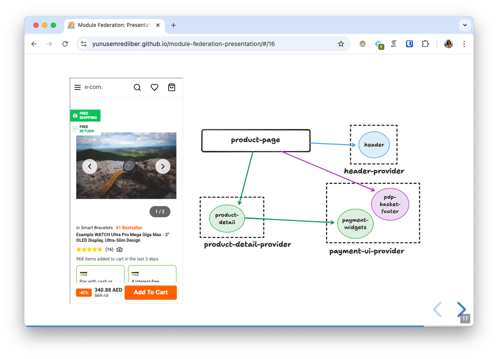

# Module Federation Presentation

Presentation URL: [https://yunusemredilber.github.io/module-federation-presentation](https://yunusemredilber.github.io/module-federation-presentation/#/)

The repo contains the presentation and demo apps for the Module Federation talk.



## Demo Apps

### 1. Development

Run the following command:

```sh
pnpm dev
```

It will start the development server for all apps in ./apps folder.

### 2. Production

Run the following command:

```sh
pnpm build
```

It will build all apps in ./apps folder.
You can run [`serve`](https://www.npmjs.com/package/serve) command in the root and visit `http://localhost:3000/apps/example-page/dist/index.html` to see the production build.

> Use `BASE_URL` env variable to set the base url for the apps while building.

## Presentation

- `index.html` - The presentation content using [reveal.js](https://revealjs.com/).
- `public/*` - The images and styles for the presentation.
